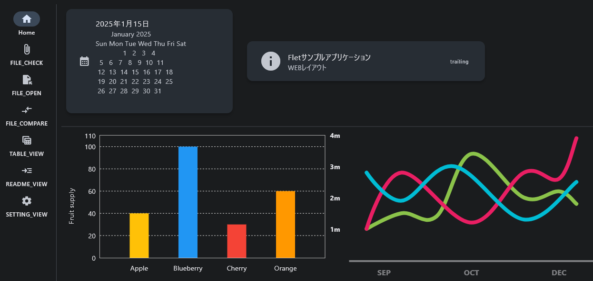
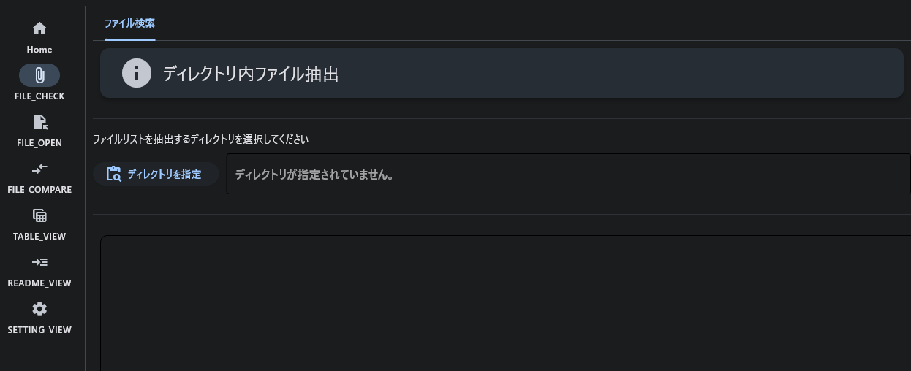
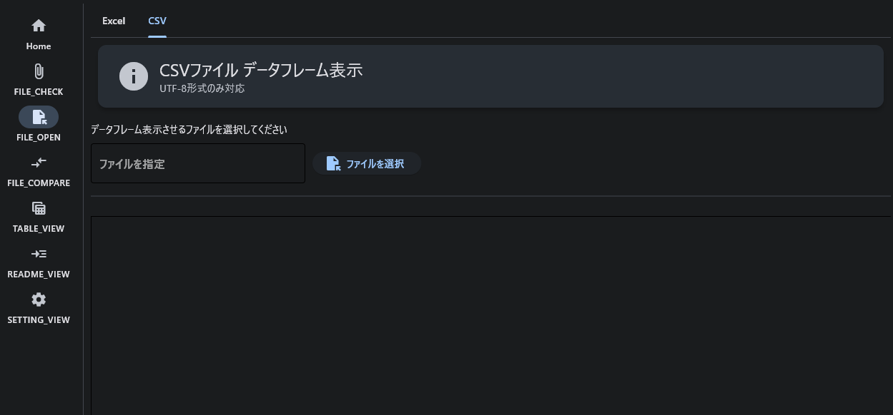
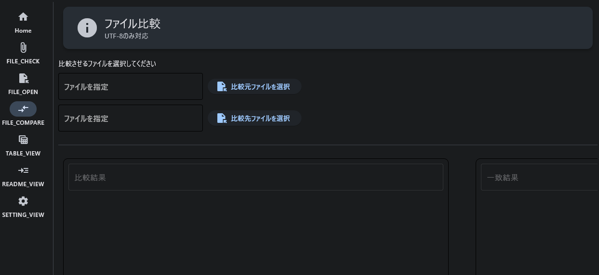
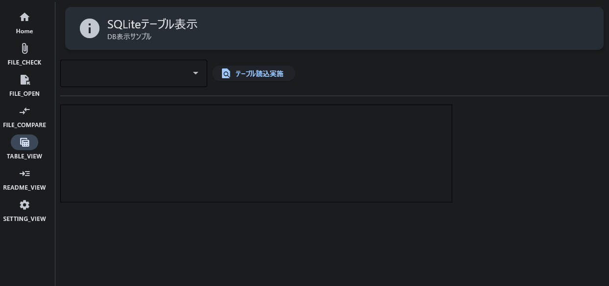
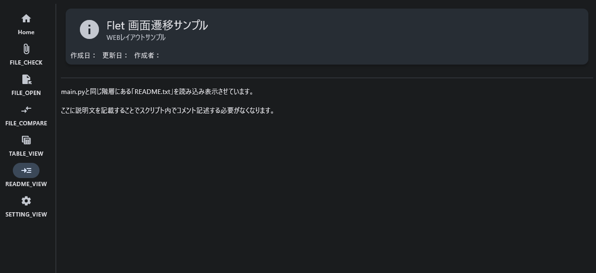

<!-- プロジェクト名を記載 -->

## Flet_WEBLayout_Sample README

### 使用技術一覧

<!-- シールド一覧を記載 -->
<div id="top"></div>
<p style="display: inline">
    
</p>

---

<!-- 目次を記載 -->

## 目次

- [Flet_WEBLayout_Sample README](#flet_weblayout_sample-readme)
  - [使用技術一覧](#使用技術一覧)
- [目次](#目次)
- [本スクリプトについて](#本スクリプトについて)
  - [概要](#概要)
- [コンテンツ概要](#コンテンツ概要)
  - [機能一覧](#機能一覧)
    - [ダッシュボード](#ダッシュボード)
    - [ディレクトリ検索](#ディレクトリ検索)
    - [ファイル読込#1](#ファイル読込1)
    - [ファイル比較](#ファイル比較)
    - [データテーブル操作](#データテーブル操作)
    - [ファイル読込#2](#ファイル読込2)
    - [画面遷移](#画面遷移)
- [ディレクトリ構成](#ディレクトリ構成)
- [導入方法](#導入方法)
  - [事前準備](#事前準備)
- [トラブルシューティング](#トラブルシューティング)

---

<!-- プロジェクトの説明を記載 -->

## 本スクリプトについて

Python クロスプラットフォームデスクトップアプリを作成する際に **Flet** を採用する場合のサンプルとなります。<br>
<br>

<!-- プロジェクトの概要を記載 -->

### 概要

画面構成は _WEB レイアウト画面構成(マルチカラムレイアウト)_ を採用しています。<br>
サイドナビゲーションよりコンテンツを切り替えられます。<br>
各コンテンツでは以下のサンプル機能を実装しています。<br>

| 機能                    | ナビゲーションメニュー名 |
| :---------------------- | :----------------------- |
| ダッシュボード          | /(HOME)                  |
| ディレクトリ走査        | FILE＿CHECK              |
| ファイル操作(読込/比較) | FILE_OPEN/FILE_COMPARE   |
| テーブル操作            | DATA_TABLE               |

---

<!-- 実装機能の概要を記載 -->

## コンテンツ概要

各コンテンツ(機能)は個々のページとして実装しています。<br>
親ページ内のコンテンツ領域に各機能を上書きすることで画面遷移を行っています。<br>

::: note info
**今回の実装ではページ間のデータ引き渡しは実装していません。**<br>
:::

### 機能一覧

実装している各機能と定義しているファイルは以下の通り。<br>

**格納ディレクトリ：components/Views/**

| No  | 機能               | ファイル名    | 概要                                                                                                                                                          |
| :-- | :----------------- | :------------ | :------------------------------------------------------------------------------------------------------------------------------------------------------------ |
| 1   | ダッシュボード     | index.py      | Flet コントロールのカード、チャートを使用したダッシュボードサンプル                                                                                           |
| 2   | ディレクトリ検索   | file_check.py | 指定ディレクトリ内のファイル、サブディレクトリ情報の取得 <br> 結果の Flet リストビューコントロール表示サンプル                                                |
| 3   | ファイル読込#1     | file_open.py  | csv、Excel ファイル読み込み(pandas データフレーム) <br> simpledatatable へのデータフレーム格納、Flet データテーブル・リストビューコントロールへの表示サンプル |
| 4   | ファイル比較       | file_diffs.py | ファイル Diff(Difflib)結果の Flet テキストフィールドコントロール格納サンプル                                                                                  |
| 5   | データテーブル操作 | db_tables.py  | SQLite DB の新規作成、テーブルデータの読み込みおよび Flet リストビューコントロール格納サンプル                                                                |
| 6   | ファイル読込#2     | readme.py     | テキストファイルの読み込みおよび Flet リストビューコントロール へのテキスト格納サンプル                                                                       |

#### ダッシュボード



Flet の以下コントロールを用いてダッシュボード風の画面を構成するサンプルとなります。<br>

**利用 Flet コントロール**
| No | 階層 | コントロール名 |
| :-- | :------------------ | :----------- |
| 1 | Layout | Card |
| 2 | Layout | Column |
| 3 | Layout | Container |
| 4 | Layout | Divider |
| 5 | Layout | ListTile |
| 6 | Layout | Row |
| 7 | Information Displays | Icon |
| 8 | Information Displays | Text |
| 9 | Charts | BarChart |
| 10 | Charts | LineChart |

:::note info
カードでは、Python 標準ライブラリの*calendar*、*datetime*を使用して日時情報およびカレンダーを実装するサンプルとなっています。
:::

#### ディレクトリ検索



指定ディレクトリを走査し、走査結果をデータフレーム表示するサンプルとなります。<br>

**利用 Flet コントロール**
| No | 階層 | コントロール名 |
| :-- | :------------------ | :----------- |
| 1 | Layout | Card |
| 2 | Layout | Column |
| 3 | Layout | Container |
| 4 | Layout | Divider |
| 5 | Layout | ListView |
| 6 | Layout | Row |
| 7 | Layout | Tabs |
| 8 | Layout | View |
| 9 | Information Displays | Icon |
| 10 | Information Displays | Text |
| 11 | Information Displays | ProgressRing |
| 12 | Buttons | ElevatedButton |
| 13 | Input and Selections | TextField|
| 14 | Utility | FilePicker|

#### ファイル読込#1



指定されたファイルのデータを取得し、データを表示するサンプルとなります。<br>

**利用 Flet コントロール**
| No | 階層 | コントロール名 |
| :-- | :------------------ | :----------- |
| 1 | Layout | Card |
| 2 | Layout | Column |
| 3 | Layout | Container |
| 4 | Layout | Divider |
| 5 | Layout | ListTile |
| 6 | Layout | ListView |
| 7 | Layout | Row |
| 8 | Layout | Tabs |
| 9 | Layout | View |
| 10 | Information Displays | Icon |
| 11 | Information Displays | Text |
| 12 | Information Displays | ProgressRing |
| 13 | Buttons | ElevatedButton |
| 14 | Input and Selections | TextField|
| 15 | Utility | FilePicker|

#### ファイル比較



指定ファイルを比較した結果を表示するサンプルとなります。<br>
この機能では*difflib*ライブラリを使用して比較を行っています。<br>

**利用 Flet コントロール**
| No | 階層 | コントロール名 |
| :-- | :------------------ | :----------- |
| 1 | Layout | Card |
| 2 | Layout | Column |
| 3 | Layout | Container |
| 4 | Layout | Divider |
| 5 | Layout | ListView |
| 6 | Layout | Row |
| 7 | Layout | View |
| 8 | Information Displays | Icon |
| 9 | Information Displays | Text |
| 10 | Information Displays | ProgressRing |
| 11 | Buttons | ElevatedButton |
| 12 | Input and Selections | TextField|
| 13 | Utility | FilePicker|

#### データテーブル操作



SQLite を操作するサンプルとなります。<br>
現在の実装ではデータベーステーブルの新規作成、データベースファイルの読み込みまでとなります。<br>

**利用 Flet コントロール**
| No | 階層 | コントロール名 |
| :-- | :------------------ | :----------- |
| 1 | Layout | Card |
| 2 | Layout | Column |
| 3 | Layout | Container |
| 4 | Layout | Divider |
| 5 | Layout | ListView |
| 6 | Layout | Row |
| 7 | Layout | View |
| 8 | Information Displays | Dropdown |
| 9 | Information Displays | Text |
| 10 | Information Displays | Icon |
| 11 | Information Displays | Text |
| 12 | Buttons | ElevatedButton |

#### ファイル読込#2



テキストファイルの読み取り結果を表示するサンプルとなります。<br>

**利用 Flet コントロール**
| No | 階層 | コントロール名 |
| :-- | :------------------ | :----------- |
| 1 | Layout | Card |
| 2 | Layout | Column |
| 3 | Layout | Container |
| 4 | Layout | Divider |
| 5 | Layout | ListView |
| 6 | Layout | Row |
| 7 | Layout | View |
| 8 | Information Displays | Icon |
| 9 | Information Displays | Text |

#### 画面遷移

画面遷移は以下ファイルで実施しています。<br>
routes.py はクラス化しています。<br>

1. routes.py
2. nav_side.py

main.py 内で以下の関数を読み込みコンテンツ領域(Body)にて画面遷移を行っています。<br>

```bash
<main.py>
#関数呼び出し
from components.Views.routes import Router
from components.user_controles.nav_bar import NavBar
from components.user_controles.nav_side import NavMenu
~中略~
#画面遷移処理部
    # 画面遷移処理(./components/Views/routes.py)定義
    routes = Router(page)
    page.on_route_change = routes.route_change

    # 画面構成定義
    page.add(
        ft.Row(
            [
                ft.Column([NavMenu(page),]),
                ft.VerticalDivider(width=1),
                ft.Column([ routes.body ], alignment=ft.MainAxisAlignment.START, expand=True,auto_scroll=True),
            ],
            alignment=ft.MainAxisAlignment.START, expand=True
        ),
    )
    # index.py(/)を初期画面に設定
    page.go('/')
```

routes クラスで画面遷移用の URL を定義しています。<br>

```bash
<routes.py>
    def __init__(self, page):
        self.page = page
        self.routes = {
            "/": IndexView(page),
            "/FILE_OPEN": FileOpenView(page),
            "/FILE_CHECK": FileCheckView(page),
            "/FILE_COMPARE": FileDiffView(page),
            "/DATA_TABLE": DBView(page),
            "/README_VIEW": ReadView(page),
            "/SETTING_VIEW": SettingsView(page),
            #------#
        }
        #初期表示View
        self.body = ft.Container(content=self.routes['/']["view"])
```

---

<!-- ディレクトリ構成を記載 -->

## ディレクトリ構成

本スクリプトのディレクトリ構成は以下となります。<br>

📦Flet_WEBLayout_Sample
┗ 📂dev
┃ ┗ 📂EXE
┃ ┃ ┣ 📂components
┃ ┃ ┃ ┣ 📂user_controles
┃ ┃ ┃ ┃ ┣ 📜nav_bar.py
┃ ┃ ┃ ┃ ┗ 📜nav_side.py
┃ ┃ ┃ ┗ 📂Views
┃ ┃ ┃ ┃ ┣ 📂db
┃ ┃ ┃ ┃ ┃ ┗ 📜data.db
┃ ┃ ┃ ┃ ┣ 📜db_tables.py
┃ ┃ ┃ ┃ ┣ 📜file_check.py
┃ ┃ ┃ ┃ ┣ 📜file_diffs.py
┃ ┃ ┃ ┃ ┣ 📜file_open.py
┃ ┃ ┃ ┃ ┣ 📜index.py
┃ ┃ ┃ ┃ ┣ 📜readme.py
┃ ┃ ┃ ┃ ┣ 📜routes.py
┃ ┃ ┃ ┃ ┗ 📜settings.py
┃ ┃ ┣ 📜main.py
┃ ┃ ┣ 📜README.md
┃ ┃ ┣ 📜README.txt
┃ ┃ ┗ 📜requirements.txt

---

<!-- 導入補法を記載 -->

## 導入方法

本スクリプトの導入は*Flet_WEBLayout_Sample.exe*をダウンロードした後に Python 実行環境内に展開して下さい。<br>

### 事前準備

スクリプト実行前に実行環境にて以下ライブラリの導入を行ってください。<br>

```bash
python -m pip install flet
python -m pip install difflib
python -m pip install pandas
python -m pip install simpledatatable
```

---

<!-- トラブル時の対処法を記載 -->

## トラブルシューティング

- pip のバージョンが古い場合はアップグレードを実施して下さい。
- 必要なライブラリが導入済みか確認ください。
